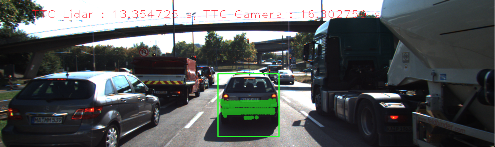
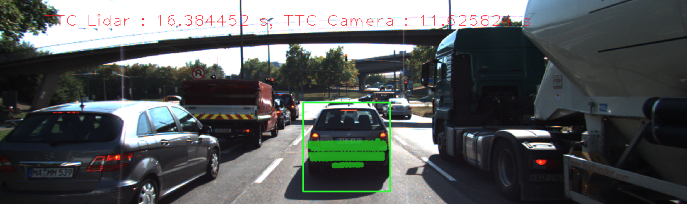
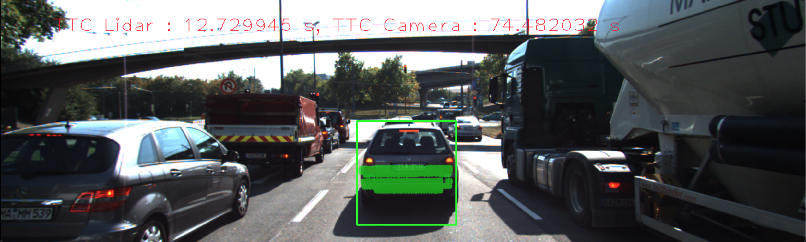

# Performance Evaluation 1

The unusually low TTC from the Lidar would likely be linked to outliers and/or sparse clusters in the cameras frame of reference.

The unusually high TTC from the Lidar could also be attributed to outliers as well as cluster false positives that have lower return intensity than what they should have.

Find examples where the TTC estimate of the Lidar sensor does not seem plausible. Describe your observations and provide a sound argumentation why you think this happened.

# Performance Evaluation 2

The negative infinity TTC from the camera is likely due to the median distance ratio being close to 1, which would cause a division by zero case.

The high increase in TTC from the camera is due to rapid fluctuations in disparity between the keypoints. This would result from a combination of anomalous descriptors and/or detection outliers.

After compiling the frame-by-frame results in `experiment.xlsx`, the average TTC for the lidar and each of the 20 detector/descriptor pairs was determined. Compared to the lidar average TTC, the top 3 closest detector/descriptor average TTCs were:

1. AKAZE/FREAK
2. AKAZE/BRISK
3. AKAZE/BRIEF